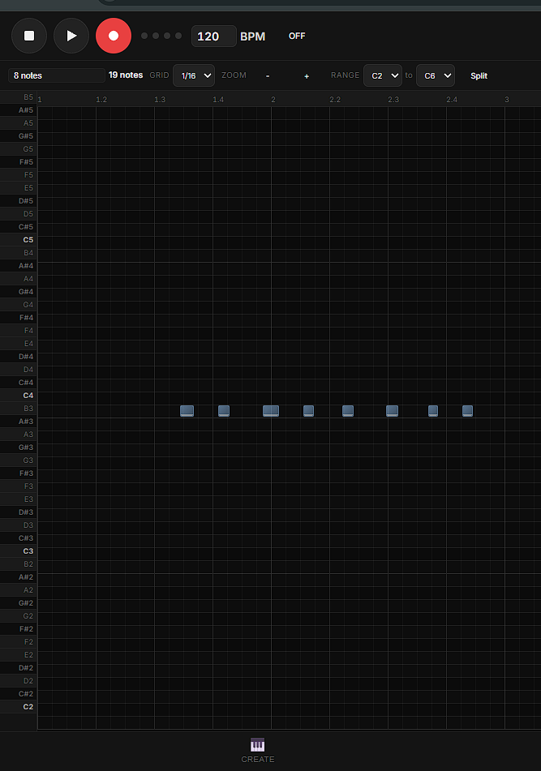
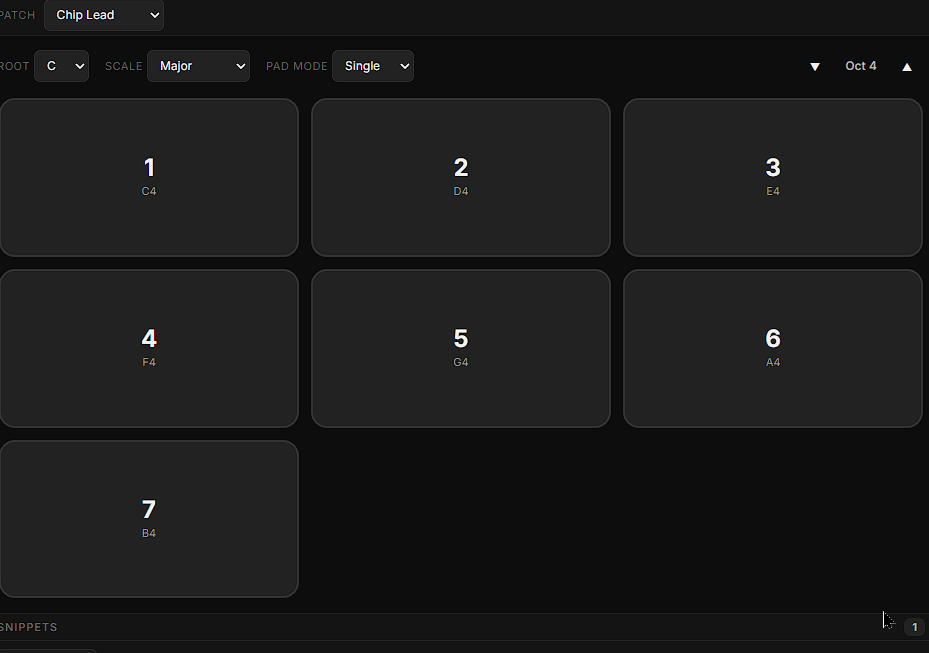
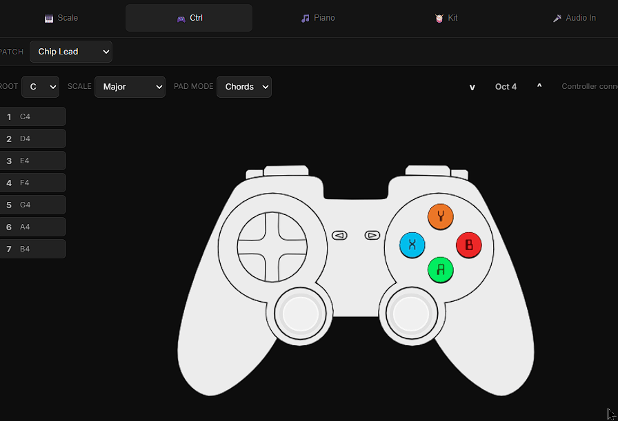
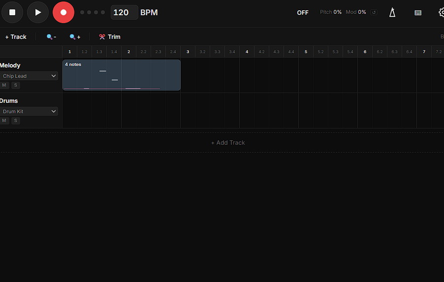
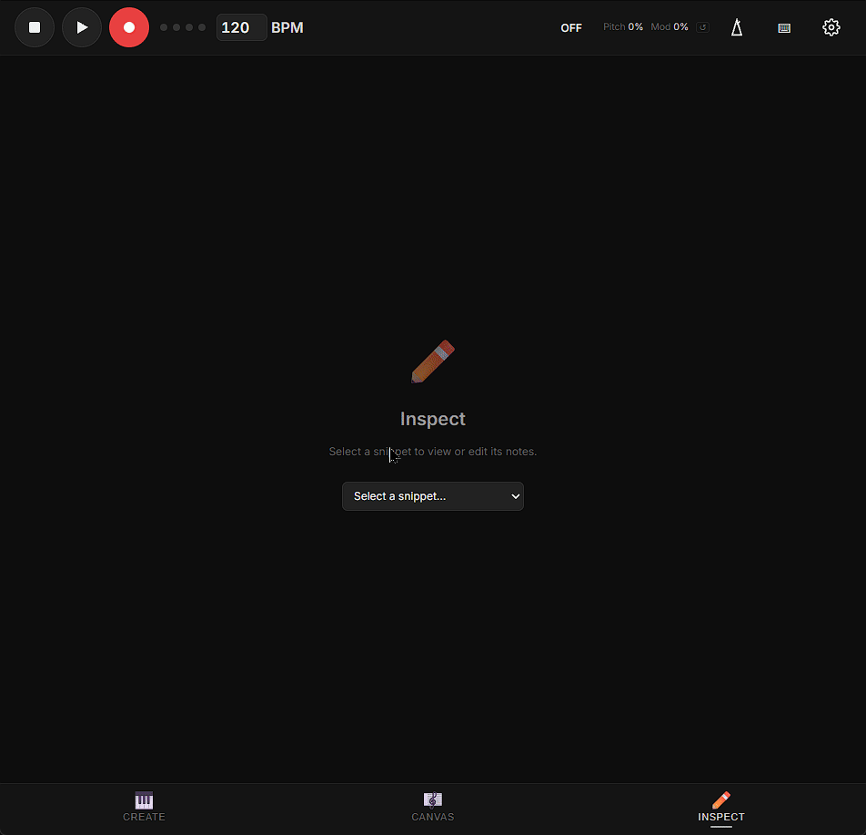

<div align="center">

# 🎵 Notenotes

**A free, open-source musical sketchpad — for anyone who's ever wanted to make music but didn't know where to start.**

[**▶ Try it now**](https://zeidalidiez.github.io/Notenotes/) · [Report an idea](https://github.com/zeidalidiez/Notenotes/issues/new) · [Contribute](#-contributing)



</div>

---

## Why Notenotes exists

Most music software assumes you already know music. It hands you a piano roll, a stack of MIDI channels, and a click track, then waits for you to be a producer. If you don't already speak that language, the door is closed.

**Notenotes is the door open.** It's a tiny, browser-based sketchpad for capturing the *idea* of a melody — a hummed phrase, a beat in your head, a chord you stumbled into — before it disappears. No accounts, no installs, no theory exam at the entrance.

The bet is simple: **most people have music in them.** What they don't have is a frictionless way to get it out. So Notenotes leans into ideas that don't usually show up in DAWs:

- 🎨 **Color over notation.** Beats can be colors. Pads can be colors. You can read a song the way you'd read a painting.
- 🎮 **Gamepads as instruments.** Plug in a controller — the buttons become your scale. Surprisingly expressive, surprisingly fun.
- 🔒 **Scales that don't let you play "wrong."** Lock the pads to a key and every press lands somewhere musical.
- 🖼️ **Songs as canvas.** Drag blocks of sound around like paint. Composition becomes spatial, not theoretical.
- 💾 **Yours, locally, forever.** Everything lives in your browser. No cloud, no signup, no "free tier."

This isn't a DAW. It's not trying to be one. It's the napkin you scribble a song on at 2am — and a quietly opinionated argument that the napkin should be available to everyone.

---

## ⚡ Try it in 10 seconds

> 🌐 **Live app:** [zeidalidiez.github.io/Notenotes](https://zeidalidiez.github.io/Notenotes/)

No install. Click a pad. You're making music.

It's a Progressive Web App — install it from your browser and it works offline forever.

---

## 🎬 A quick tour

### Create — the jam space



Pick a scale. Mash the pads. Switch instruments mid-loop. Press record, jam, press stop — your loop becomes a snippet.

### Controller — your gamepad is an instrument



<sub>Controller artwork by [nicefrog](https://opengameart.org/users/nicefrog) — [Generic Gamepad Template](https://opengameart.org/content/generic-gamepad-template), released under [CC0](https://creativecommons.org/publicdomain/zero/1.0/). Thank you, nicefrog. 🐸</sub>

Plug in any USB or Bluetooth controller. D-pad and face buttons map to the scale. Analog sticks bend pitch and add modulation. Pass the controller to a friend who's never touched a keyboard — watch what happens.

### Canvas — composition as collage



Drag your captured snippets onto a timeline. Stretch them, mute them, layer them. Hit play and listen to the song you didn't know you were writing.

### Inspect — when you're ready for detail



Open any snippet in a piano roll for fine edits. Click to add notes, drag to move them. Or skip this entirely — Notenotes works without it.

---

## ✨ What's in the box today

### 🎹 Five ways to play

| Instrument | What it is |
|---|---|
| **Scale Board** | Up to 16 pads locked to any scale (Major, Minor, Pentatonic, Blues, Dorian, Mixolydian, Chromatic). Pad count follows scale degrees, or go fully custom. |
| **Controller** | Gamepad-as-instrument via the Web Gamepad API. D-pad + face buttons play notes; analog sticks bend pitch and modulation. Live on-screen overlay shows what you're pressing. |
| **Micro Piano** | Configurable chromatic keyboard (1 or 2 stacked, 10–32 keys each) with octave shifting. |
| **Sketch Kit** | 10-pad synthesized drum kit. Four kit presets (Classic, 808, Electronic, Acoustic). |
| **Audio In** | Record from any input device with a live waveform. Audio snippets become draggable clips just like MIDI. |

Plus: **8 synth presets** (Chip Lead, Warm Pad, Glass Pluck, Sub Bass, Bright Lead, Tape Keys, Dusty Organ, Vinyl Strings) — and the entire instrument layer is [pluggable](#-build-your-own-instrument).

### 🎨 Built around accessibility

- **Scale-locked pads** — every press is in key. You can't pick a wrong note.
- **Beat colors** — set a different color for each beat. The background pulses in time so you can *see* the meter.
- **Hold & arpeggio modes** — latch notes, auto-arpeggiate chords across **10 chord types**, **4 patterns**, and **4 rates**. Or sustain a drone while you explore.
- **Keyboard shortcuts as instrument** — number row triggers pads, letter row triggers piano keys, `ArrowUp`/`ArrowDown` shift octave.
- **Pitch & mod via QWERTY** — Korg K25-style mod (1/4/7) and pitch (3/6/9) when keys aren't in use.
- **Mobile-first, including iOS Safari** — touch drag-and-drop everywhere, transport collapses on narrow screens, audio-gesture quirks worked out.

### 🪄 Three modes for three states of mind

- **Create — playing and capturing.** 8 synth presets, 4 drum kits, scale-locked or chromatic, hold and arpeggio modes.
- **Canvas — arranging.** Multi-track timeline with drag-and-drop, per-track mute / solo, a one-click **✂️ Trim** to clean empty space, and an auto-calculated loop region. Recorded **pitch-bend** and **modulation** ride on each clip as orange and pink overlays.
- **Inspect — refining.** Click-to-add piano roll. Vertical zoom, configurable octave range (C1–C6), **split view** for two-handed work, **2×** / **½** snippet length buttons, and a **Quantize all** button to snap an entire snippet to the grid.

You never have to leave Create to make a song. The other modes are there when you want them.

### 💾 Yours, locally, no strings

- **Local-first.** IndexedDB storage. No accounts, no cloud sync, no telemetry.
- **PWA.** Installable, works offline, lives on your home screen.
- **Auto-saves up to 5 versions** — restore any one from history.
- **Customizable everywhere.** 2/4, 3/4, 4/4, and 5/4 time signatures. Custom beat colors for the background visualizer. Configurable pad, piano-key, and drum counts.
- **Snippets are nameable** — and auto-named ones update themselves as you edit.
- **Exports.** Sheet music as **SVG** or **ABC**, with a **percussion clef** for drum snippets. MIDI, WAV, and MP3 are on the [roadmap](#-where-its-going).

---

## 🚀 Run it locally

### Prerequisites
- **Node.js 20+** (LTS recommended)
- **npm**

### Install & run

```bash
git clone https://github.com/zeidalidiez/Notenotes.git
cd Notenotes
npm install --legacy-peer-deps
npm run dev
```

The app opens at [http://localhost:5173/](http://localhost:5173/). Click any pad to wake the audio engine — browsers require a user gesture before they'll make sound.

### Build for production

```bash
npm run build      # outputs to dist/, PWA-ready
npm run preview    # serve the production build locally
```

---

## 🗺️ Where it's going

These are the ideas that drive the project. Some are coded, some are sketches, some are wild — **all of them are conversations open for contribution.** If something here sparks you, [open an issue](https://github.com/zeidalidiez/Notenotes/issues/new) or [a discussion](https://github.com/zeidalidiez/Notenotes/discussions). Help wanted.

### 🎤 More ways in
- [ ] **Hum-to-melody** — sing into the mic, the app transcribes it as MIDI you can edit.
- [ ] **Tap-to-rhythm** — clap or tap to set tempo and seed a beat.
- [ ] **MIDI device support** — bring your own keyboard, pad controller, or wind instrument.
- [ ] **Webcam motion controls** — wave your hand to bend pitch; conduct your own loop.
- [ ] **Touch + accelerometer** — on mobile, tilt for modulation, tap velocity for dynamics.
- [ ] **Foot pedals & accessibility switches** — every input becomes an instrument.

### 🎨 Color & visualization
- [x] **Per-beat colors** in the background visualizer.
- [ ] **Per-pad colors** — paint the Scale Board however helps you remember.
- [ ] **Color-blind safe palettes** as a first-class option.
- [ ] **Synesthesia mode** — clips on the Canvas glow their note color as they play.
- [ ] **Color-strip notation** as an alternative to the piano roll.

### 🔒 "You can't play wrong" guardrails
- [x] **Scale lock** on the pads.
- [ ] **Chord lock** — only chords that fit the song's key are reachable.
- [ ] **Drone mode** — sustain the root of your key in the background as a tonal anchor.
- [ ] **Suggest-next-chord** — gentle prompts when you want them, invisible when you don't.
- [ ] **Humanize toggle** on auto-quantize — perfectly imperfect timing.

### 🌍 Capture & share
- [ ] **Song-as-link** — share a complete song via URL. Receivers open it in their browser, instantly.
- [ ] **MIDI / WAV / MP3 export** alongside ABC and sheet music.
- [ ] **Embeddable player** for blogs, social posts, and personal sites.
- [ ] **Collaborative jam mode** — two people, two browsers, one loop.

### 🎓 Learning ramps
- [ ] **First 5 Melodies** — interactive guided onboarding for absolute beginners.
- [ ] **Practice mode** — paste a melody, the app shows you how to play it on the Scale Board.
- [ ] **Lyric notepad** — write words next to the notes they fit.
- [ ] **Beginner challenges** — small, finishable songwriting prompts.

### 🔊 Sound expansion
- [ ] **Found-sound recorder** — sample your environment, drop it into the kit.
- [ ] **Body percussion** — claps and snaps recognized via mic become a drum lane.
- [ ] **User samples** — drag-and-drop your own audio as instruments.
- [ ] **More synth presets and kits** — community-contributed.

If your idea isn't here, **add it.** This list is the project.

---

## 🛠️ Build your own instrument

Notenotes' instruments are vanilla JavaScript classes. There's no framework to fight. If you can write a class with a `render()` method, you can ship a new instrument.

### Pattern

```js
export class MyInstrument {
  constructor(synth, project) {
    // Store dependencies
  }

  init() {}                   // Optional: post-audio-engine setup

  render() {                  // Required: return DOM element
    this.el = document.createElement('div');
    this.el.className = 'my-instrument';
    return this.el;
  }

  setHitCallback(onHit) {}                  // For drum-style triggers
  setNoteCallbacks(onNoteOn, onNoteOff) {}  // For pitched notes
}
```

### Wiring it in (6 lines, ish)

1. Create `src/instruments/MyInstrument.js`
2. Import it in `src/modes/CreativeMode.js`
3. Instantiate in the constructor
4. Pass `project` in the `set project(p)` setter
5. Add it to the `views` array in `render()`
6. Add a tab to the instrument switcher

For a deeper reference — including a synthesized drum sound built from oscillators and noise — read [`src/instruments/SketchKit.js`](src/instruments/SketchKit.js). It's heavily commented and uses every Web Audio primitive worth knowing. Architectural context, audio-scheduling rules, and the data model live in [`AI.MD`](./AI.MD).

---

## ⌨️ Keyboard shortcuts

| Key | Action |
|---|---|
| `Space` | Play / Pause |
| `Enter` | Stop (rewind to loop start) |
| `R` | Toggle recording |
| `M` | Toggle metronome |
| `Ctrl+Z` / `Ctrl+Shift+Z` | Undo / Redo |
| Scale `1`–`9`, `0` | Hold visible scale pads |
| Kit `1`–`9`, `0` | Trigger drum pads |
| Piano `` ` ``–`=` | Hold piano keys left to right |
| `ArrowUp` / `ArrowDown` | Octave shift (Scale Board, Micro Piano, Controller) |
| `Delete` / `Backspace` | Delete selected note or clip |
| `Ctrl+click` | Delete a note (Inspect) or clip (Canvas) |
| `Alt+drag` | Resize note (Inspect) or clip (Canvas, shrink) |
| Hold `1` / `4` / `7` | Modulation down / reset / up (when not in use) |
| Hold `3` / `6` / `9` | Pitch bend down / reset / up (when not in use) |

---

## 🏗️ Tech stack

| Layer | Technology |
|---|---|
| **Build** | [Vite](https://vitejs.dev/) 8.x |
| **Audio** | Web Audio API — AudioContext, OscillatorNode, BiquadFilterNode |
| **Persistence** | IndexedDB via [idb](https://github.com/jakearchibald/idb) |
| **Sheet music** | [abcjs](https://paulrosen.github.io/abcjs/) |
| **PWA** | [vite-plugin-pwa](https://vite-pwa-org.netlify.app/) |
| **Framework** | None. Pure vanilla ES Modules. |

### Why no framework?

Web Audio is allergic to surprise. A virtual DOM diff at the wrong moment is a click in your loop. Every DOM update in Notenotes is intentional and audio-aware — and the codebase stays small enough to read in an afternoon.

---

## 📁 Project structure

```
Notenotes/
├── index.html                 # PWA entry point
├── vite.config.js             # Vite + PWA config
├── public/                    # Icons, manifest
└── src/
    ├── main.js                # App bootstrap
    ├── style.css              # Design system
    ├── engine/                # Audio core (transport, scheduler, theory, recording)
    ├── instruments/           # Sound generators (Scale Board, Piano, Kit, Mic, Synth)
    ├── modes/                 # Create, Canvas, Inspect views
    ├── ui/                    # Transport bar, tabs, settings drawer, snippet tray
    ├── data/                  # IndexedDB persistence + undo manager
    └── export/                # ABC notation + sheet music renderer
```

---

## 🎬 Improving the GIFs

The clips above were captured by hand and they're meant to evolve. If you want to refresh them, demonstrate a feature better, or contribute alternate captures, here's the recipe:

1. **Tool to install:** [Kap](https://getkap.co) (Mac), [ScreenToGif](https://www.screentogif.com) (Windows), or [Peek](https://github.com/phw/peek) (Linux). All free.
2. **Aspect:** record the browser window at ~1280×720 for sharp playback in the README.
3. **Export:** GIF or short MP4. Keep clips **5–10 seconds**, **under 5MB**.
4. **Replace** `scale.gif`, `controller.gif`, `canvas.gif`, or `inspect.gif` in the repo root with your new capture.

> 💡 The most compelling clips show **a real interaction**: pressing pads, dragging clips, switching instruments. Avoid showing menus — show *making music*.

---

## 🤝 Contributing

Notenotes is built in the open and grows with its community. Whether you're filing a bug, sketching a feature, or adding an instrument:

1. **[Browse open issues](https://github.com/zeidalidiez/Notenotes/issues)** — `good first issue` is a real label here.
2. **[Open a discussion](https://github.com/zeidalidiez/Notenotes/discussions)** for ideas that don't fit a single ticket.
3. **Fork → branch → PR.** Keep PRs small and focused; describe the user-facing change.
4. **Music tests welcome.** A 10-second clip of "this used to break and now it doesn't" is a perfectly good test.

### For AI agents working on this codebase

If you're an AI agent assisting with this project, **read [`AI.MD`](./AI.MD) first.** It contains architectural context, audio-scheduling gotchas, and the exact state shape of the IndexedDB store. When you solve a non-obvious problem, append your findings to the bottom of `AI.MD` rather than deleting existing context.

---

## 🙏 Credits & acknowledgments

Notenotes stands on the shoulders of generous people who share their work freely.

- **Controller artwork** — [Generic Gamepad Template](https://opengameart.org/content/generic-gamepad-template) by [**nicefrog**](https://opengameart.org/users/nicefrog), released as **CC0 (public domain)** via [OpenGameArt.org](https://opengameart.org). Attribution wasn't required, but nicefrog made this app friendlier and we'd rather say thank you than not. 🐸
- **[abcjs](https://paulrosen.github.io/abcjs/)** — ABC notation rendering for the sheet music export.
- **[idb](https://github.com/jakearchibald/idb)** — the friendliest possible wrapper around IndexedDB.
- **[vite-plugin-pwa](https://vite-pwa-org.netlify.app/)** — making Notenotes installable and offline-ready with one config block.

If you spot anything in this repo that's missing a credit it deserves, please [open an issue](https://github.com/zeidalidiez/Notenotes/issues/new) — we'll fix it fast.

---

## 📄 License

[MIT](./LICENSE) — do anything you want with it, just keep the license notice. FOSS forever.

---

<div align="center">

**Made for napkins, hummed phrases, and 2am ideas.**

[▶ Open Notenotes](https://zeidalidiez.github.io/Notenotes/) · [⭐ Star on GitHub](https://github.com/zeidalidiez/Notenotes)

</div>
